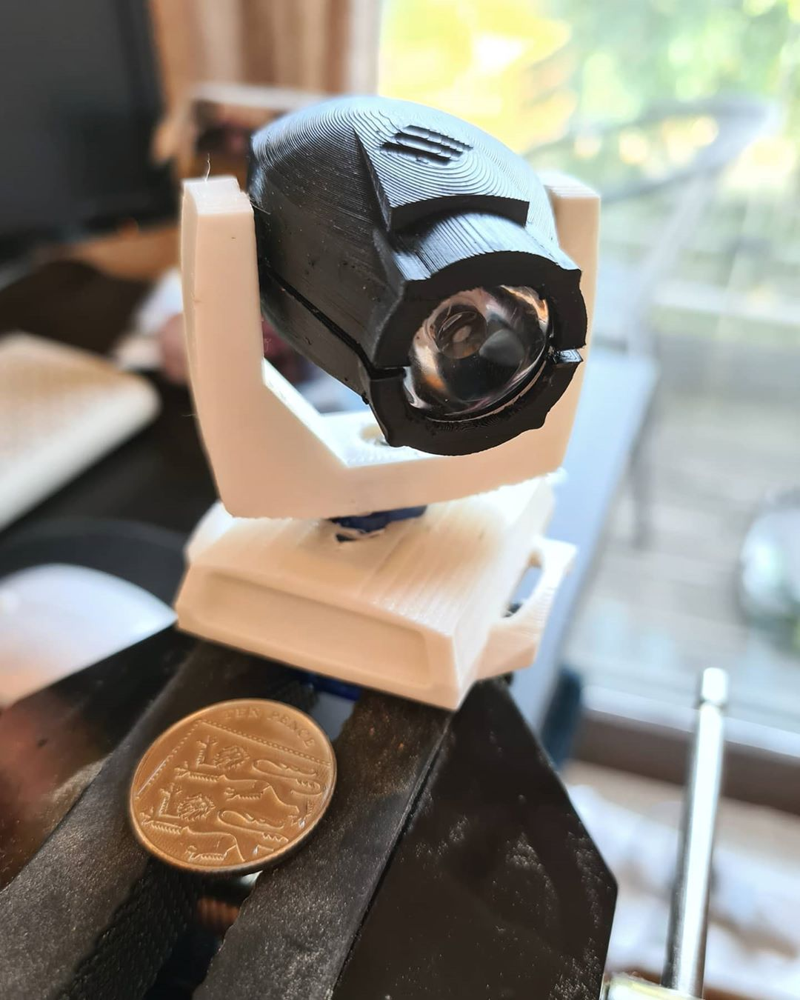

# movingEdd - a miniature moving head lighting fixture

This is the project repository for the miniature moving head light as part of the [miniTheatreProject](https://github.com/cooke001/miniTheatreProject).

The moving head light can pan and tilt +-90 degrees from home, and uses an adafruit pixel as a light source.
This is controlled via an arduino, however it's expected that this may move to an ESP board - this can all be found at [miniTheatreProject](https://github.com/cooke001/miniTheatreProject).

## Bill of Materials

|Item|Qty.|Notes|
|---|---|---|
|SG90 Servo Motor|2|One with wings chopped off|
|Adafruit Pixie|1|I had to trim this down however will fix this at some point...|
|Hookup wire|3|3 different colours for ease when routing through the yoke|
|30 degree lens|1|I used [this one](https://www.ebay.co.uk/itm/10pcs-30-degree-led-Lens-for-1W-3W-5W-Hight-Power-LED-with-Holder-FOHGUK/193228555050?hash=item2cfd51c32a:g:HGMAAOSwmUdUXbOJ) and snapped off the black plastic|
|10mm OD/ 3mm ID bearing|8|I used this part from RS - [6189856](https://uk.rs-online.com/web/p/ball-bearings/6189856/)|

## Printing
### Cura Settings
I printed this in PLA with an ender 5 plus, using these settings:
* 0.1mm Layer Height
* 40mm/s speed
* Brim
* Enable Supports
* Enable Retraction
* 20% infill, but graduated infill for the yoke if possible

### Print Orientation and placement
* Yoke - vertically with arms point upward
* Body - this will need to be mirrored in Cura to produce 2 parts, mirrored. Outer facing upward
* Base - Right way up

### Assembly
1. Remove yoke supports using a bit of wire to push it out
2. Attach pan servo into base - this may require trimming
3. Route a servo cable and 3 bits of wire through yoke
4. Push wires from yoke through base, then attach yoke to base servo using screw
5. Attach tilt servo in place
6. Solder LED to 3 wires
7. Slide one of the body pieces into place - this is quite tricky but is strong enough to deal with bending a bit.
8. Push wires into gap where body meets yoke.
9. Add LED lens
10. Push other body piece into place ensuring LED mates with lens - this is tricky but just push it and it'll probably not break.
11. Solder wires together as appropriate to make '5V','GND','LEDSignal','panSignal' and 'tiltSignal'.
12. Add some heatshrink and connectors as you want - I used some jumper wires for ease but may end up putting a mini connector on soon.
